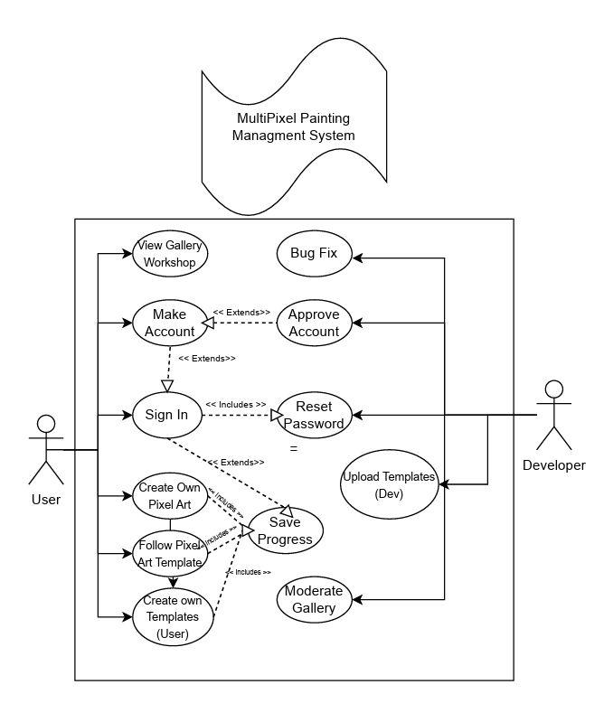

Group 04 – "MultiPixel"\
Date and location: Feb 11, 2024\
Group Members: Aidan Trujillo, Hunter Beach, Colton Leighton, Mathew Gardner, Thomas Rotchford

# D2 Deliverable

## 1. Positioning

#### Problem statement:
> "The problem of limited creative outlets for relaxation and self-expression on the web affects stressed individuals who can't run or afford a download-based video game; the impact of which is individuals being compelled to engage with web-based games that are poorly made or uninteresting, and downloadable programs that our poorly optimized or overly expensive."

#### Product Position Statement:
> "For individuals experiencing stress who prefer a hassle-free web-based solution over downloadable games, MultiPixel offers a unique online video game experience. Users can unwind and relax by coloring a diverse collection of pixel art drawings using the popular "Color by Numbers" method. What sets MultiPixel apart from other pixel-based coloring games is the ability for users to not only color existing drawings but also create and share their pixel art masterpieces. Our platform features a community hub where users can showcase their creations, allowing others to download and enjoy coloring their artwork, fostering a collaborative and creative community experience. "

#### Value proposition and customer segment:
> "MultiPixel is an online relaxation video game designed to offer a more enjoyable experience for stressed individuals during their leisure time.  Our program is unique as it offers free, easy access to pixel painting software, which can be interacted with anytime, simply through a web browser, helping solve the problem above. Additionally, it fosters a sense of community through a workshop feature where users can showcase their creations, allowing others to download and enjoy coloring their artwork."

> Stressed individuals who can't run or afford a download-based video game

## 2. Stakeholders

As for stakeholders, we have 5 major groups to look into. First is the People who will play the game. These stakeholders will influence our project by giving it a player base, giving our game popularity, and will be our main impetus for developing this program. Second, we have Developers / Systems. These stakeholders will influence our project by giving it form, without these stakeholders our project will have nothing to stand on. Third, we have our clients and our boss. These stakeholders will give us a review, and instruct us on what segments of our program ought to be changed. Fourth, we have the competitors. These stakeholders will be the program we need to compete against. We need to find what makes other pixel art software  or web-based games successful, take those aspects for ourselves, and find what other competitors lack, and offer that in our project. Lastly, we have distractors. These are people who think they might like our game but are incorrect. They may unknowingly dislike, web-based, artistic, or relaxing games, but might blame it on our product, so we need to recognize these stakeholders to better understand our review

Below are some examples of some of these stakeholders

People who will play the game:
- Students in class
- Artists
- People who want a relaxing game
- People who want multiplayer with friends and Competitors
- any other pixel-based software
- web games that are played in class

Developers/Systems:
- Group Members
- AWS
- Data Base
- Graphic Designers

Clients/Boss:
- People who will play the game
- Ana Paul Chaves

Competitors
- Other Pixel Software:
  - Coloring Pixels
  - Aseprite
  - Krita
  - Pixel Motion
  - Pixel Studio
  - Multi Painter
- Other Web-Based Games:
  - Solo Relaxing Games:
       - Slither.io
       - Wordle
       - New York Times
  - Multiplayer Games:
       - Town Of Salem
       - Catan Universe
       - Chess
  - Artistic Games:
       - Garlic Phone
       - Quick Draw
       - Skribble.io

Distractors:
- People who dislike Web-based games
- People who dislike artistic games
- People who dislike relaxing games
- People who dislike solo games

## 3. Functional requirements (features) 
menus

1. Access Menu Homepage
   - Sign up
   - Log in
   - Browse workshop
     - Browse Art
     - Browse Templates
   - Draw on a clear grid
   - Draw on a template
   - Configure UI/UX Options
   - View your portfolio
2. Browser Workshop (Extended Description)
   - Scroll through popular posts
   - Search for specific posts
   - Filter by tag
   - Moderate workshop
3. Draw on grid/template (Extended Description)
   - Choose from 16 base colors
   - Resize Grid
   - Load new grid
   - Save the current grid
   - Load new template/grid
   - Switch between template/grid
5. Edit a portfolio of projects
   - Save Project
   - Copy Project
   - Delete project
   - Create Folder
4. Configure UI/UX
   - Turn on Color blindness mode
   - Configure Text size 
   - Configure SFX
   
## 4. Non-functional requirements

*Non-functional requirements* 

1. Security (Makes sure the site is secure and users cannot access other users' profiles. All sensitive information is encrypted and locked on the database)
     - User names and passwords stored on the database
        - Have these values and other sensitive information encrypted and locked
            - Can only be accessed by us 5 admins via passcode
     - 
3. Performance (Allows a seamless user experience between all aspects of the site)
     - Website should have specific UI/UX options set up for each different type of device display
     - Website should load any page within less than 2 seconds, especially when receiving data from the database
     - Program to save an image, convert it to a number-based .txt file, and upload it to the database should take less than 10 seconds
     - If we receive any reports of bugs or lag or broken displays, we will go fix them
     - A new user can use any functionality in the software without error
     - No buttons or links will lead to the wrong areas
       
4. Portability (Users should be able to use the website on any device that can connect to the site)
     - Game and site work on both a computer and a smartphone through the browser
     - All different displays should also have all functions listed above

5. Availability (Site should almost always be available, and not crash minimally)
     - The site Will be up 90% of the time, considering we are still in the working phase
     - This gives us 18 days of general unavailability for this semester
     - As such we will have it not running, for at most 18 days.
     - Any crash reports we will fix in less than 7 days
      
6. Maintainability (Codebase should be written and commented to allow future upgrades and additions with ease)
     - We will maintain this commenting technique
       - Every Line of code will have at least one comment explaining its use
       - Certain blocks will have flags showing where they start and stop
         - IE <!-- HEADER START --> code here <!-- HEADER END -->
       - Every function or cohesive block will have a comment above explaining its purpose
     - We will maintain this code-writing technique for clarity
        - We will have a blank line in between lines of code
        - we will follow NAU's GUR for indentations and brackets

## 5. MVP

Our MVP will be the combination of the following aspects of our Functional requirements:

1. Menu homepage allowing access to several options
   - Button to view your portfolio
   - Buttons for each type of Pixel Art
     - Draw on a clear grid
     - Draw on a template
   - Options tab for UI/UX
3. Ability to draw on grid/template
   - 16 base colors to choose from on the left
   - Resizable x by x grid on right
   - Tab for grid options, including resizing
   - button for saving the grid
   - button for loading new templates
   - Menu option to switch back
5. Ability to save a portfolio of projects
   - Save Project
   - Delete Project
4. Ability to control UI/UX
   - SFX variability

In normal English, we want to implement a homepage with 4 main buttons, one for a clear grid, one for a template, one for a portfolio, and one for options. The clear grid and the template will be functionally the same, just with different canvases to draw on. On our drawing page, we will have 16 colors on to choose from and a resizable grid to draw on. We will have a tab for grif options including resizing, a button for loading new templates, and a button for saving the artwork. Next, we will have a portfolio visible where you can view your saved artwork. Lastly, we will have a settings tab, which will allow the user to affect SFX, by turning sound or music lower or higher.
These function requirements seem most important to implement for us to consider our product as a Pixel Art game.

## 6. Use cases

#### Use Case Descriptions and Interface Sketches:

    Use Case: Create Unique Pixel Art 
    Actor: User 
    Description: A user will open the website for MultiPixel, and be able to pick colors from a palate to paint with onto a canvas of pixels. 
    Preconditions: The user has access to the website through any means. The user navigated a UI menu to reach the drawing page 
    Postconditions: The user will have created art which they may or may not save

    Main Flow:
    1. The user opens the app for MultiPainter having already traversed the UI Menu to reach the "Create Pixel Art" page
    2. The user login/sign up
    3. The user picks colors from the palette and places them onto a canvas in whatever order they please, making their art
    4. The user may or may not choose to save this art they made

    Alternative Flow:
    1. The user does not log in or sign up
    2. The user picks colors from the palette and places them onto a canvas in whatever order they please, making their art
    3. The user is not able to save

    Use Case: Sign in
    Actor: User 
    Description: A user will login to the website for MultiPixel using either a previous login page or the lower right menu.
    Preconditions: Game mode page and art interface are on the same page 
    Postconditions: Game modes may change throughout drawing process if changed in game mode menu.

    Main Flow:
    1. The user opens the login/sign up page or the main interface page.
    2. The user logs in/signs up.
    3. The user picks game mode and may play once screen is used.
    4. The user may or may not choose to save this art. They can also change tyhe game mode using the side screen.

    Alternative Flow:
    1. The user switches game mode mid game.
    2. The user signs in or resets password using lower right page which sends them to alternative page.
    3. The user is not able to save their game.
    

    Use Case: Adjust game settings
    Actor: User 
    Description: The user will click on the settings "gear-icon" on the homepage of multipixel and be able to adjust the volume,brightness, UI scale, and several other things.
    Preconditions: The user is able to access the homepage 
    Postconditions: The user will have changed and saved the game and UI settings to their desired specifics

    Main Flow:
    1. User clicks the "gear-icon" on home page
    2. User adjusts setting silders to their perfered values
    3. User may choose to save selected settings or not
    4. User is auto redirected to the home page with new settings applied

    Use Case: Follow Pixel Art Template 
    Actor: User 
    Description: A user will open the website for MultiPixel, and be able to pick a template to paint by numbers
    Preconditions: The user has access to the website through any means. The user navigated a UI menu to reach the drawing page 
    Postconditions: The user will have colored a painting.

    Main Flow:
    1. The user clicks on a template they want to complete
    2. The template is loaded for the user to color
    3. The user begins filling in the numbers with the corresponding color
    4. A finish message is loaded that prompts user to save.
    5. The user selects to save.
    6. The painting is saved to users account.

    Alternative Flow:
    1. The user decides to go back without saving.
    2. System loads the template list again. 

    Alternative Flow:
    1. The user is not logged in.
    2. System prompts user to log in.
    3. The user then logs in.
    4. The user is now able to save.

    Alternative Flow: 
    1. The user does not have an account.
    2. The user is prompted to create an account.
    3. The user account is created. 
    4. The painting is saved to their account. 

    Use Case: View the community workshop
    Actor: User 
    Description: A user will open the website for MultiPixel, enter the community tab and view other users uploaded artwork.
    Preconditions: The user has access to the website through any means. The user navigated a UI menu to reach the community page.
    Postconditions: The user will have created a account on the site, and have logged into it when accessing the site.

    Main Flow:
    1. The user clicks on the menu option titled "Community".
    2. The page is changed to show a feed of others artwork.
    3. The user can click on a specific artworks page to view more about the piece.
    4. The user can decide if they want to try filling in the picture by clicking a "Draw now" button.
    5. The user page changed to the drawing page with the template of the community drawn picture.

    Alternative Flow:
    1. The user has not created a account.
    2. System loads the login screen.

    Alternative Flow:
    1. The user is not logged in.
    2. System prompts user to log in.
    3. The user then logs in.
    4. The user is now able to browse the community hub. 

#### Use Case Diagram

## 7. User stories
Establish a priority level for each user story and estimate how many hours each one will demand using the planning poker approach. 

Grading criteria (6 points): Use the provided format. The user stories should be in an adequate level of granularity (not too broad nor too specific). Provide the priority and estimation for each user story.

##### Matthew:

- As a user looking for ideas, I want to be able to see others' pixel art so that I can get ideas.
    - Functional Requirement: Browse Workshop
    - Priority: 6
    - Estimation: 2 Hours
- As a continuous user, I want to be able to log in / out so that I can save my pixel art.
    - Functional Requirement: Log In
    - Priority: 5
    - Estimation: 1 Hour

##### Thomas:

- As A color blind Artist, I want to use a colorblind mode in the game,
    - Priority: 10
    - Estimation: 2 Hours
- As an artist, I want to be able to customize my palette, so that I can paint with my favorite colors
    - Priority: 8
    - Estimation: 5 Hours

##### Aidan:

- As a user I want to be able to create my pixel paintings so that I can share my artwork with others. 
    - Priority: 2 
    - Estimation: 3 Hours
- As a developer, I want the ability to ban user accounts so that there is a respectful and encouraging environment.
    - Priority: 1
    - Estimation: 1 Hours

##### Hunter:

- As an artist who likes to collect my art I want a portfolio so that I can easily access anything I've made before.
    - Priority: 3
    - Estimation: 3 Hours
- As a user who enjoys multiplayer competitive games, I want an interesting competitive game mode to play against my friends, so that I may have fun.
    - Priority: 5
    - Estimation: 6 Hours

##### Colton:

- As a user who enjoys relaxing online games, I want the sign in pop up screen for my games 
to be easy to use and almost instant, so that I may sign in quickly and play in a complete, optimized way.
    - Priority: 4
    - Estimation: 5 Hours
- As a user who plays multiplayer games, I want a few different strategic game modes including a competitive one amongst others, so that I may play competitively if I want, or in a different strategic manner if I feel inclined.
    - Priority: 3
    - Estimation: 4 Hours

## 8. Issue Tracker

https://github.com/thomasrotchford/CS386-2024-multiPainter/issues

